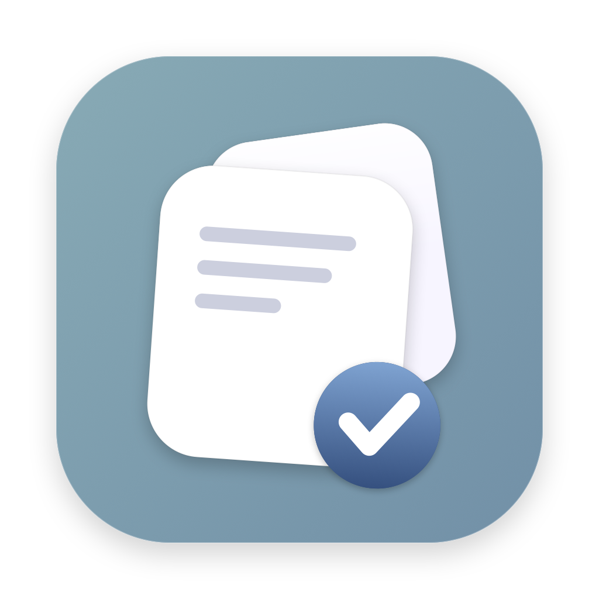

<div align="center">
  
  <h1>Insert</h1>
  <p>A calm, native macOS app for your projects, notes and tasks — stored as plain Markdown.</p>
</div>

---

**Insert** is a three-column macOS app (macOS 26, SwiftUI, Liquid Glass):

- **Projects** on the left — your projects and topics, each with an emoji and a live `X notes · Y tasks` count. Sort by latest-used or A–Z, add/rename/delete.
- **Notes** in the middle — shown as scrollable "islands", each with a title, emoji and a Markdown body. Pick a type (Note, Meeting, Feedback, Staffing… or your own) with colored pills. Sort by created/updated and filter by type.
- **Tasks** on the right — tick them off, give them due dates, and tag one or more projects by typing `#`. Filter by all / pending / done.

The search field in the toolbar filters all three columns at once, and hiding the
sidebar gives notes and tasks half the window each.

A **menu-bar item** shows your pending tasks at a glance — a short "past · today · upcoming" summary, grouped into Overdue / Today / Up Next / Unscheduled — and lets you tick tasks off without opening the app.

Everything is saved as **plain Markdown** in a folder you choose, so your data stays yours and stays editable anywhere.

## Download

Grab the latest build from the
**[Releases page](https://github.com/nx-alejandrolacasa/insert/releases/latest)**.

> These builds aren't notarized by Apple, so Gatekeeper blocks them on first
> launch. Either **right-click Insert → Open** and confirm the dialog, or run
> `xattr -cr /Applications/Insert.app` once in Terminal.

## Build & run

Requires macOS 26 with the Xcode Command Line Tools.

```sh
./build.sh run        # build and launch the dev app (build/Insert Dev.app)
./build.sh install    # build the release app and install it into /Applications
./build.sh release    # build the release app only (what CI runs)
./dmg.sh 1.2.0        # package build/Insert.app as build/Insert-1.2.0.dmg
```

`./build.sh` builds a separate **dev** app — `Insert Dev.app`, bundle id
`com.alejandrolacasa.insert.dev` — so it runs alongside your installed copy
without sharing its settings, its Documents permission, or its notes. The dev
build keeps its Markdown in `~/Documents/Insert Dev` and shows a hammer in the
menu bar instead of the checklist. `install` and `release` build the real thing.

See [CLAUDE.md](CLAUDE.md) for the full layout, data format, and conventions.

## Sign once, grant once (stop the repeated permission prompts)

Insert keeps your notes and tasks in a folder under `~/Documents`, and macOS ties
file-access permission to the app's **signing identity**. By default the build is
**ad-hoc** signed, whose identity changes on every build — so macOS treats each
rebuild as a new app and re-asks for access. Create **stable self-signed
certificates once** and the grant sticks across all future builds.

**One-time setup (≈1 min):**

1. Open **Keychain Access** (⌘-Space → "Keychain Access").
2. Menu bar → **Keychain Access → Certificate Assistant → Create a Certificate…**
3. Fill in:
   - **Name:** `Insert Dev` ← must match exactly
   - **Identity Type:** Self-Signed Root
   - **Certificate Type:** Code Signing
4. Click **Create** → Continue through the warning → **Done**.
5. Repeat for a second certificate named `Insert Release` — that's the one
   `./build.sh release`, `./build.sh install` and CI use, so a locally-installed
   copy and a released DMG share one identity (and one permission grant).

Verify they're there:

```sh
security find-identity -v -p codesigning   # should list both
```

> Want different names? `INSERT_SIGN_IDENTITY="My Cert" ./build.sh`.

## Releasing

Push a version tag (`vX.Y.Z`) and GitHub Actions takes it from there — builds the
app, packages a DMG, and publishes a GitHub Release with install instructions
attached. See [`.github/workflows/release.yml`](.github/workflows/release.yml).

```sh
git tag v0.2.0 && git push origin v0.2.0
```

For the release to be signed with the stable identity rather than ad-hoc, export
the `Insert Release` certificate (Keychain Access → right-click → Export… as
`.p12`) and add two repository secrets:

| Secret | Value |
| --- | --- |
| `INSERT_CERT_P12` | `base64 -i Insert-Release.p12 \| pbcopy` |
| `INSERT_CERT_PASSWORD` | the password you set when exporting |

Without them the workflow still succeeds — the app is just ad-hoc signed, and
each update re-prompts for Documents access.

## Storage layout

```
~/Documents/Insert/         (changeable in Settings → Storage)
  Notes/       one Markdown file per note
  Tasks/       one Markdown file per task
  Projects.md  the list of projects
```

Notes and tasks carry their metadata in a small YAML frontmatter block and their
content as Markdown — open the folder in any editor and everything just works.

## Shortcuts

- **⌘ + (key left of 1)** — show / hide the projects sidebar
- **⌘N** — new note · **⌘T** — new task · **⇧⌘N** — new project
- Type **`#`** in a task to tag a project (Tab picks the first match)

---

© 2026 Alejandro G. Lacasa.
